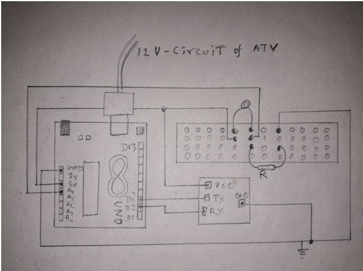

# RemoteBatteryTempratureSensing
<h2 >This projects shows how we automated to get messages of our E-ATV's battery's temperature remotely to our phones, while the ATV is on track !

<h3 allign="right">The project's construction requirments are:</h3>
1-Arduino board and its accessories

2-Temprature sensor (Thermistor)

3-GSM module

<h3 > The program is as follows (C++/Arduino) :

<allign="center">#include <SoftwareSerial.h>

SoftwareSerial SIM900A(10,11); // RX | TX

// Connect the SIM900A TX to Arduino pin 2 RX. 

// Connect the SIM900A RX to Arduino pin 3 TX. 

int ThermistorPin = 0;   // analog pin 0 for taking input from thermistor to Arduino board

int Vo;                            // voltage between thermistor and know resistor

float R1 = 10000;

float logR2, R2, T;

float A = 1.009249522e-03, B = 2.378405444e-04, C = 2.019202697e-07;

void setup() {

  SIM900A.begin(9600);   // Setting the baud rate of GSM Module  

  Serial.begin(9600);    // Setting the baud rate of Serial Monitor (Arduino)

  Serial.println ("SIM900A Ready");

  delay(1000);

}

void Sendmessage(){

  // defining function that sends temperature as message

  mySerial.println("AT+CMGF=1");    //Sets the GSM Module in Text Mode

  delay(1000);  

  mySerial.println("AT+CMGS=\"+911234567890\"\r"); // Setting the mobile no. to which temperature will be sent

  delay(1000);

  mySerial.println("Temp (degree_celcius) = ")

  delay(100)

  mySerial.println(c);// The temp to be sent

  delay(100);

   mySerial.println((char)26);// ASCII code of CTRL+Z

  delay(1000);

  mySerial.println("\n\n\n")    // Next message showing temp will be easily distinguishable 

}

void loop() {

  Vo = analogRead(ThermistorPin);

  R2 = R1 * (1023.0 / (float)Vo - 1.0);

  logR2 = log(R2);

  T = (1.0 / (A + B*logR2 + C*logR2*logR2*logR2));

  T = T - 273.15;                     // add T = (T * 9.0)/ 5.0 + 32.0; in next line to make temp in fahrenheitv

  Sendmessage()

  delay(3000) // after every 3 seconds the mobile no. entered above will recieve a new message showing the current temperature

}

<h2> The circuit is as follows : 

          
